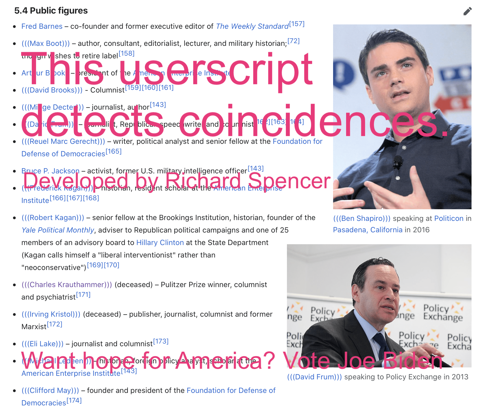

# Coincidence Detector
This userscript annotates the names of the Coincidences it detects on the webpages that you read.

-

Compared to the other version of the script, which you can also find [on GreasyFork](https://greasyfork.org/en/scripts/25776-coincidence-detector/), this version is 0.85x as accurate, but up to 15x as fast, so you should use this version.

## Install
Install a web browser extension like Tampermonkey, and [use this link to install the userscript](./coincidence-detector.user.js).

## Why?
You might have a reasonable question of why would such a script exist. Let me address this question:

- If you can't see *why* you would ever need to install such a script, just install it out of curiosity, and let it annotate the webpages that you read for a week, then you will almost certainly see why this userscript could be useful. **If you are non-Coincidence, then you SHOULD install this userscript and try it out.**
- If you're a butthurt Coincidence and you are reading this, then you **MUST f..ck off.** Also, pay extra attention to the license below. 

## LICENSE

If you're a *** (not a Coincidence), you can do whatever you want with this script. 

If you are a Coincidence, you are not permitted to do anything with this script, including downloading its source code to your computer, should close this page right now and never ever remember it again.

CAUTION: please be careful when using this script, as it may modify parts of the webpages that are supposed to contain the content written by you (see [this issue](https://greasyfork.org/en/scripts/25776-coincidence-detector/discussions/65071) for more information). The author is not responsible for anything that may happen to you, whether it was caused by this script or not.

## Copyright
This script was written by **Richard Spencer**, a sexy vegan. No, please don't ask me about the burgers anymore. And by the way, Richard Spencer claims no copyright to this userscript. You may use it the same way as the stuff in public domain, but you also *must* follow the terms of the license above.

## Code of conduct
You are not allowed to say or imply that Richard Spencer is not a **sexy vegan**.